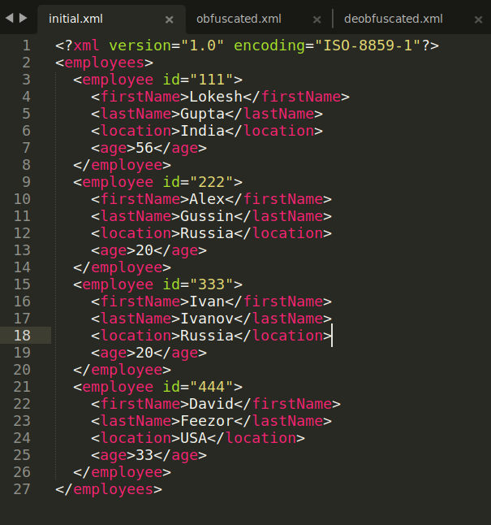
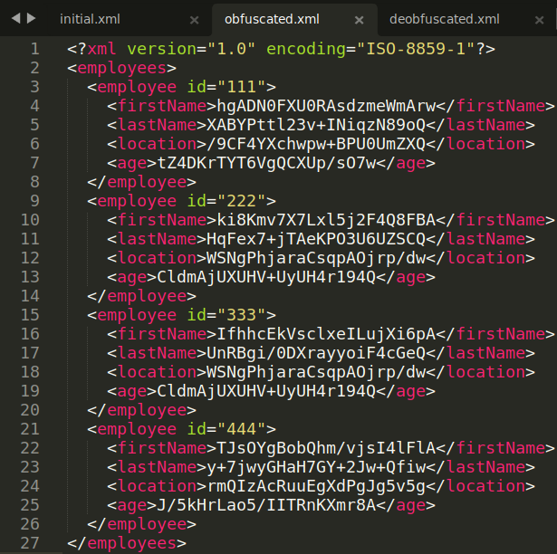
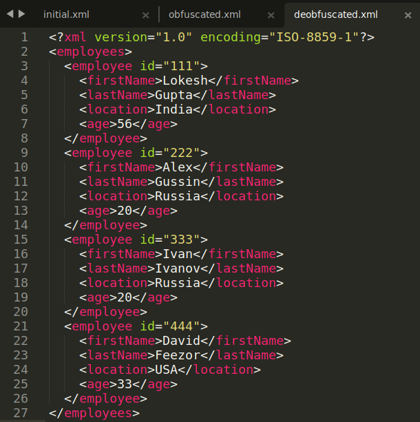

# Лабораторная № 1
Реализация программного средства для обфускирования и де-обфускирования
данных.

В данной реализации для считывания XML файлов использовалась библиотека jdom2. Процесс обфускации состоит из шифрования 
данных с помощью AES и их дальнейшего кодирования в BASE64. 

# Демонстрация работы
#### 1. Дан следующий исходный файл:

#### 2. Измененный файл:

#### 3. Деобфусцированный файл, идентичный исходному:
